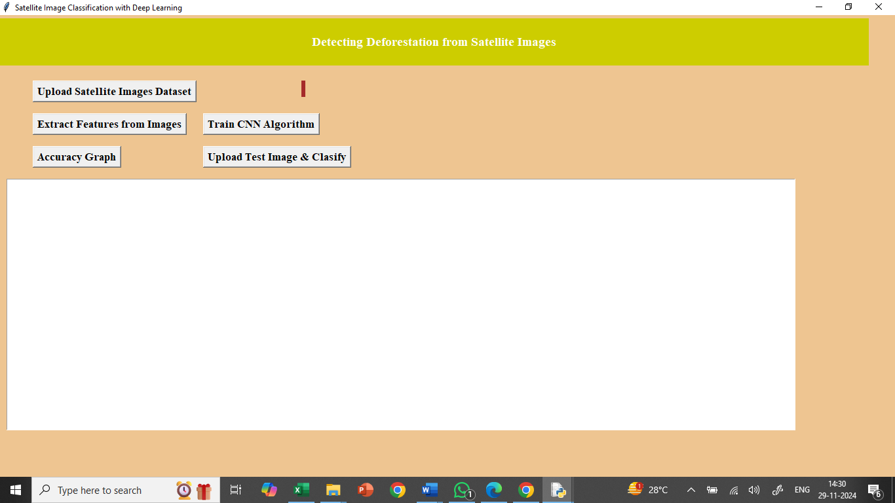
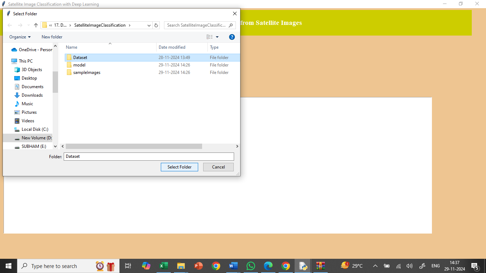
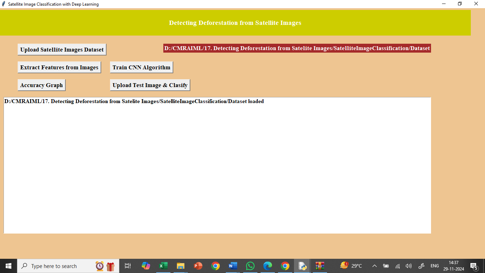
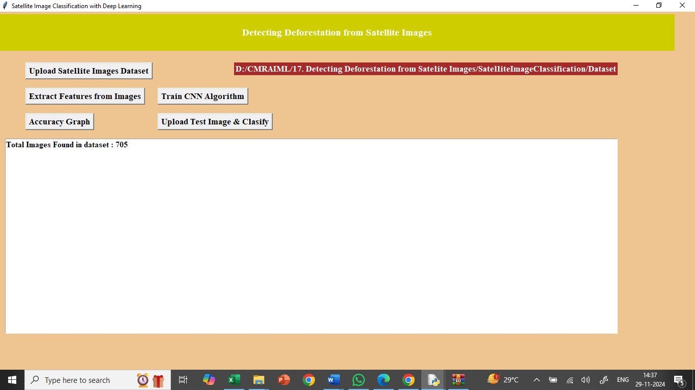
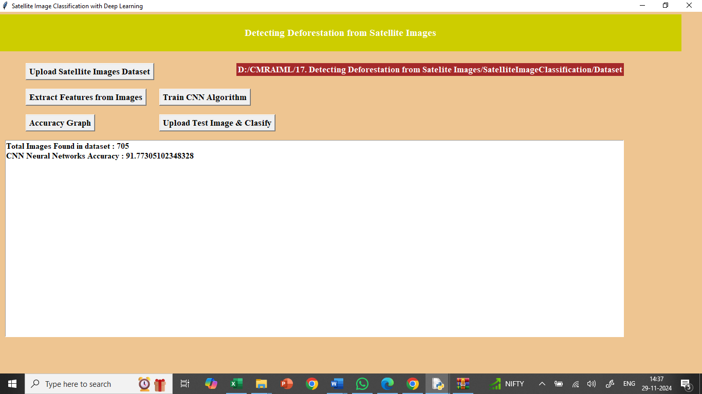
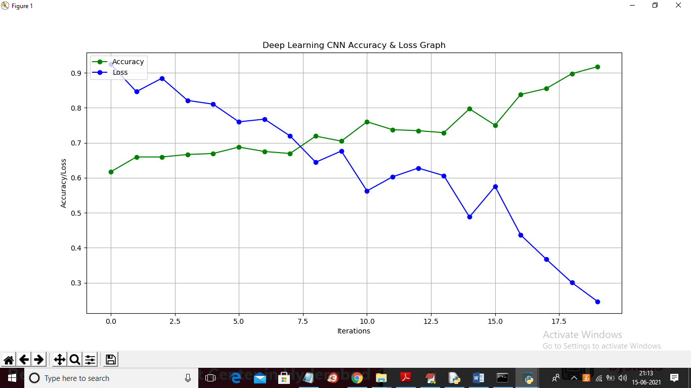
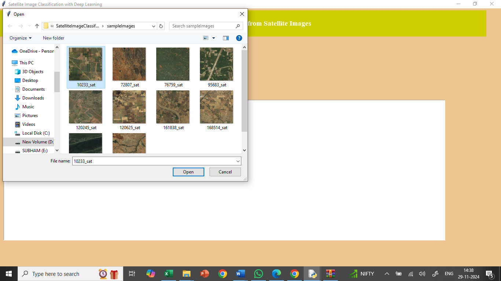
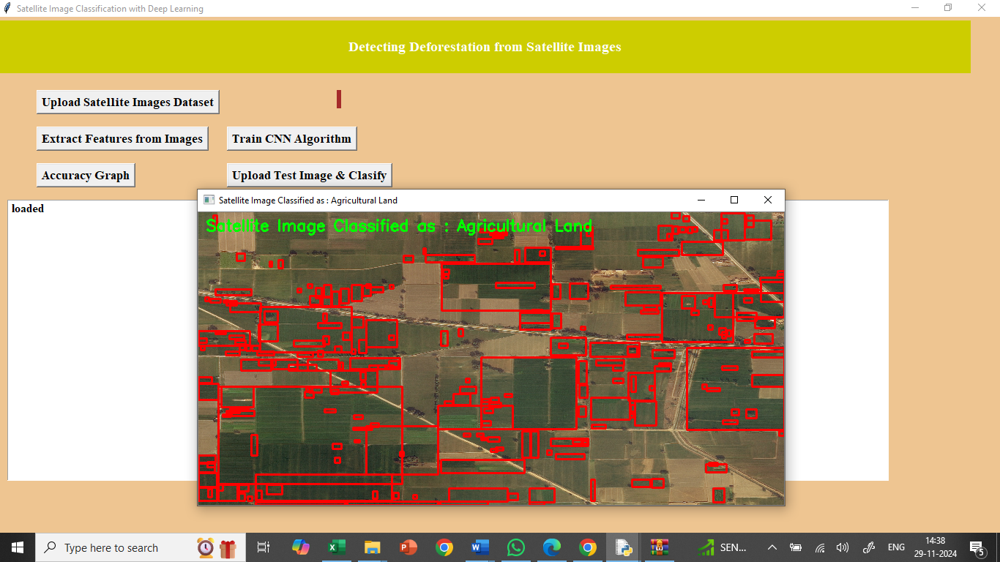
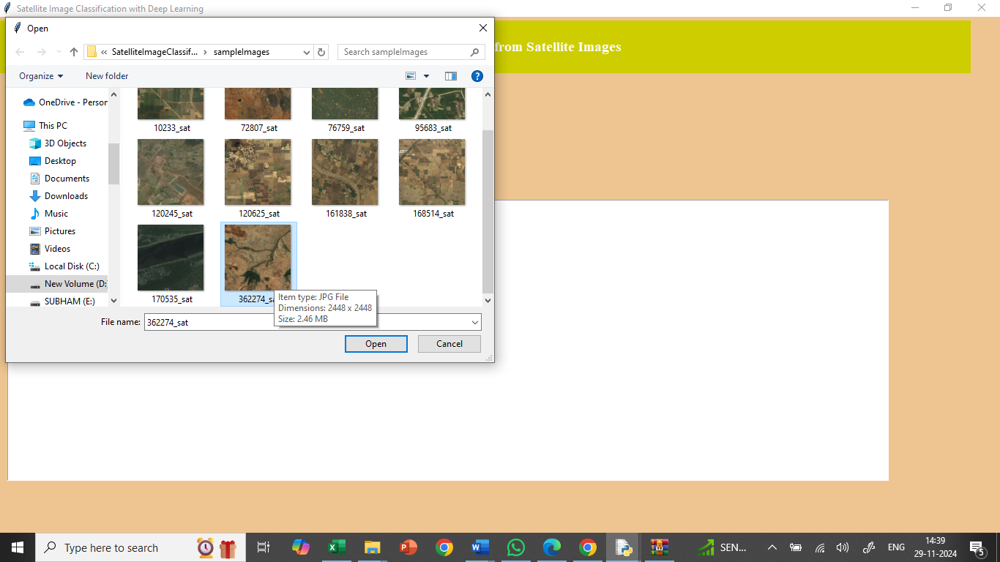
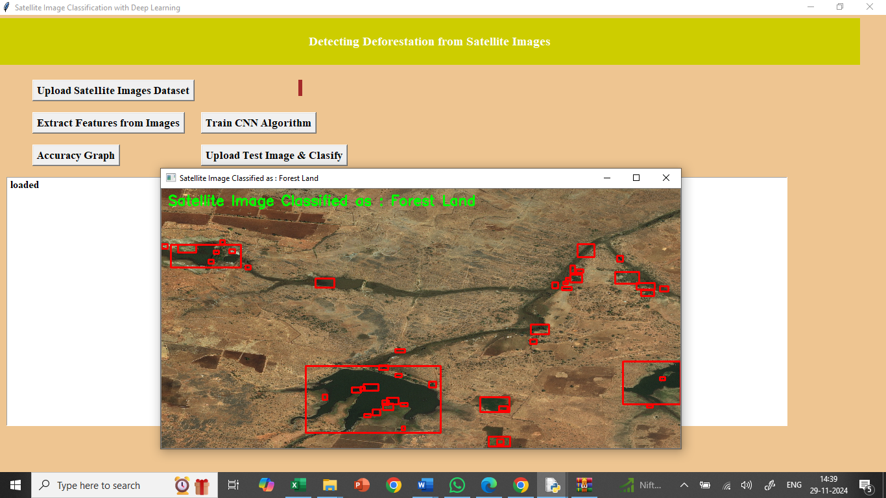

# Detecting Deforestation from Satellite Images  

## Getting Started  
To set up the project on your local machine, follow these steps:  

### **1. Clone the Repository**  
Copy and paste the following command in your terminal to clone the repository:  

```sh
git clone https://github.com/pabloescobar-reborn/Detecting_Deforestation_from_Satellite_Images.git
```

## Overview  
This project detects **deforestation** by analyzing satellite images using a **Convolutional Neural Network (CNN)**. It classifies land into:  

- **Forest Land**  
- **Non-Forest Land (Agriculture or Urban areas)**  
    
Any area **not covered by forest** is marked with **red bounding boxes**, highlighting potential deforested regions. This helps in monitoring deforestation and land-use changes.  

---

## Dataset  
- The dataset is available in the **`Dataset/`** folder.  
- It is a subset of the **IARPA Functional Map of the World (fMoW) dataset**.  
- The original dataset contains **63 classes (177GB)**, but this project uses a **smaller subset (2GB) with 3 classes**:  
  - **Forest Land**  
  - **Agricultural Land**  
  - **Urban Land**  

---

## How to Run the Project  

### 1. Run the Application  
- Double-click **`run.bat`** to start the application.This is the interface.  



### 2. Upload Dataset  
- Click **"Upload Satellite Images Dataset"** to select the dataset folder and then click on select folder.  



- The dataset will be loaded and processed.  



### 3. Extract Features  
- Click **"Extract Features from Images"** to resize images and generate training data.  
- The dataset contains **705 images** after preprocessing.  



### 4. Train the CNN Model  
- Click **"Train CNN Algorithm"** to train the model.  
- The model achieves **91% accuracy**.  
- The CNN processes images through multiple layers to improve classification accuracy.  



### 5. View Accuracy Graph  
- Click **"Accuracy Graph"** to see model accuracy over **20 epochs**.  
- The **green line** represents accuracy, and the **blue line** represents loss.  



### 6. Upload Test Image for Classification  
- Click **"Upload Test Image & Classify"** to test the model.  
- The model classifies the image and highlights **areas with red bounding boxes like for example**.  


- In above screen I am selecting and uploading ‘10233_sat.jpg’ and then click on ‘Open’ button to get below result



- In above screen in green colour text we can see image classified as ‘Agriculture Land’ and all agriculture area is **surrounded with red colour bounding boxes.** 

- Now upload other image and test



- For above selected image below is the classification result


- In above screen image classified as ‘Forest Land’ and entire forest area is surrounded with red colour bounding boxes. Similarly you can upload and test remaining images.

- **Note:** dataset size is huge with 63 different classes so I took images with 3 classes and application can classify images correctly up to 80%
---

## Results  
- The CNN model correctly classifies images into **Forest Land or Non-Forest Land**.  
- **Deforested regions (agriculture/urban areas within forests) are marked in red bounding boxes**.  
- The classification accuracy is **approximately 80%**.  

---
  
